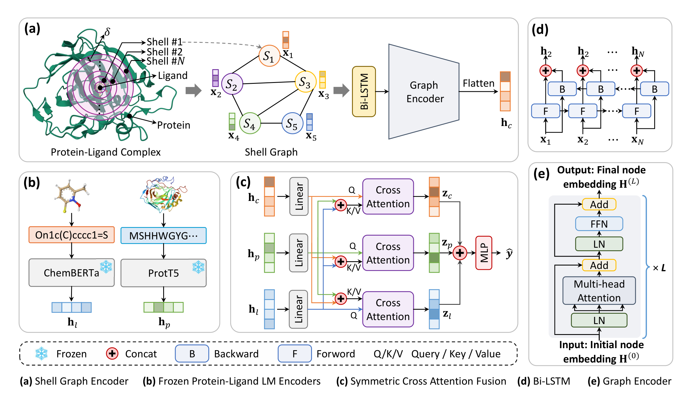

# ShellFM

Multi-view protein–ligand affinity (PLA) prediction by fusing a **frozen drug language model**, a **frozen protein language model**, and a **trainable radial shell graph** refined by a graph transformer, followed by **symmetric cross-attention** fusion and MLP regression.

## Project layout

```
ShellFM/
├── README.md
├── requirements.txt / environment.yml
├── configs/
│   ├── trifusion_prott5_u50.yaml
│   └── trifusion_efficient_esm2.yaml
├── docs/figures/
├── data/
│   ├── splits/                        # bundled PDBbind split CSVs (see data/splits/README.md)
│   ├── pdbbind_dataset.py / collate.py
│   └── ...
├── models/
├── training/                          # train_runner + five split entry points
├── utils.py
├── preprocess/                        # shell features → scaler → PyG .pt
├── scripts/download_plm.sh
└── tools/evaluate.py, aggregate_results.py
```

---

## Architecture



*Overview of ShellFM (from the paper). The structural view builds a shell graph from residue–element contact frequencies (N=60 shells), embeds nodes with a Bi-LSTM, and refines them with a graph-transformer encoder. Protein and ligand views are frozen ProtT5 and ChemBERTa embeddings. A symmetric cross-attention head fuses the three views before an MLP regresses affinity.*

---

## Environment

Requires **Python 3.10** and **CUDA 12.1** (adjust PyTorch / PyG wheels for your CUDA version).

**Option A — conda (recommended)**

```bash
conda env create -f environment.yml
conda activate shellfm
```

**Option B — pip**

```bash
pip install torch==2.1.0 torchvision==0.16.0 torchaudio==2.1.0 \
  --index-url https://download.pytorch.org/whl/cu121
pip install torch-geometric==2.5.3
pip install torch-scatter==2.1.2 torch-sparse==0.6.18 torch-cluster==1.6.3 \
  torch-spline-conv==1.2.2 -f https://data.pyg.org/whl/torch-2.1.0+cu121.html
pip install -r requirements.txt
```

`openbabel` is optional and only used as a fallback during ligand conversion in preprocessing (`conda install -c conda-forge openbabel`).

---

## Data

### Bundled split CSVs

Train/valid/test **PDB code lists** and sequence/SMILES labels are included under `data/splits/` (see `[data/splits/README.md](data/splits/README.md)`).

### Raw structures (user-provided)

Download and arrange raw complexes as follows:

```
<PDBBIND_PL_ROOT>/<year>/<pdb>/<pdb>_protein.pdb , <pdb>_ligand.sdf|mol2
<CASF_ROOT>/<pdb>/<pdb>_protein.pdb , <pdb>_ligand.sdf|mol2
<CSAR_ROOT>/<pdb>/<pdb>_protein.pdb , <pdb>_ligand.mol2
```

Point preprocessing scripts at your roots via CLI flags or environment variables (`PDBBIND_PL_ROOT`, `CASF_ROOT`, `CSAR_ROOT`, `PDBBIND_INDEX`).

---

## Preprocessing

Three steps produce `features_residue/residue_N60.npz`, its scaler, and PyG `.pt` caches.

**Step 1 — shell contact features (N=60)**

```bash
python preprocess/1_build_shell_features.py \
  --index_csvs data/splits/PL-2020R1.csv data/splits/CASF-2016.csv \
  --pdbbind_index data/splits/PL-2020R1.csv \
  --pdbbind_pl_root $PDBBIND_PL_ROOT --casf_root $CASF_ROOT --csar_root $CSAR_ROOT \
  --out_dir features_residue --staging features_residue/staging --n_shells 60
```

**Step 2 — feature scaler (train pool only, excludes CASF / CSAR)**

```bash
python preprocess/2_fit_scaler.py \
  --npz features_residue/residue_N60.npz \
  --out features_residue/residue_N60_scaler.npz \
  --train_index data/splits/PL-2020R1.csv \
  --exclude data/splits/CASF-2016.csv data/splits/CSAR-HiQ_seq_smiles.csv
```

External benchmarks are excluded from scaler statistics. CSAR-HiQ is evaluated on **81** deduplicated complexes (`CSAR-HiQ_dedup.csv`), not the full 343 — see [data/splits/README.md](data/splits/README.md).

**Step 3 — PyG dataset**

```bash
python preprocess/3_build_pyg_dataset.py --split all \
  --pdbbind_root data/splits --processed_root data_processed_esm
```

Use `--split base|random|scaffold|seq_identity|holdout|external|all` as needed.

---

## Pretrained language models (optional)

PLMs are downloaded automatically on first training run. To prefetch:

```bash
bash scripts/download_plm.sh              # ProtT5-XL-U50 + ChemBERTa (default)
bash scripts/download_plm.sh efficient    # ESM2-t6-8M + ChemBERTa
```

Configs omit `cache_path`; encoders load from HuggingFace online (`no_grad` forward).

---

## Training

Five split entry points share the same CLI (`--config`, `--data_root`, `--device`, `--no_resume`):

```bash
python training/train_base.py         --config configs/trifusion_prott5_u50.yaml
python training/train_random.py       --config configs/trifusion_prott5_u50.yaml
python training/train_scaffold.py     --config configs/trifusion_prott5_u50.yaml
python training/train_seq_identity.py --config configs/trifusion_prott5_u50.yaml
python training/train_holdout.py      --config configs/trifusion_prott5_u50.yaml
```

Lightweight variant:

```bash
python training/train_base.py --config configs/trifusion_efficient_esm2.yaml
```

Results land in `results/<split>_<tag>_lr<lr>/` with per-fold CSVs, logs, and best checkpoints. Training **auto-resumes** from existing checkpoints unless `--no_resume` is set.

---

## Pipeline validation

After running the preprocessing steps above (which create `data_processed_esm/` and
`features_residue/` under your chosen output paths), verify all five splits with the
lightweight ESM2 config (1 epoch, 1 repeat):

```bash
export LD_LIBRARY_PATH=$CONDA_PREFIX/lib:$LD_LIBRARY_PATH
export HUGGINGFACE_HUB_CACHE=/path/to/hf_cache   # must contain ChemBERTa + ESM2 weights
bash scripts/smoke_test_splits.sh
```

This runs `train_base`, `train_random`, `train_scaffold`, `train_seq_identity`, and `train_holdout` sequentially. In our smoke test, all five completed with `exit=0` (~3.5 min each on a single GPU).

---

## Evaluation

```bash
# Summarize 5-fold mean ± std from result CSVs
python tools/aggregate_results.py --results_dir results/base_shellfm_prott5_u50_d512_lr0.0001

python tools/aggregate_results.py --root results --out_csv summary_all.csv

# Re-evaluate best checkpoints on external or OOD test sets
python tools/evaluate.py \
  --config configs/trifusion_prott5_u50.yaml \
  --results_dir results/base_shellfm_prott5_u50_d512_lr0.0001 \
  --data_root data_processed_esm \
  --test_datasets CASF-2016 CSAR-HiQ
```
